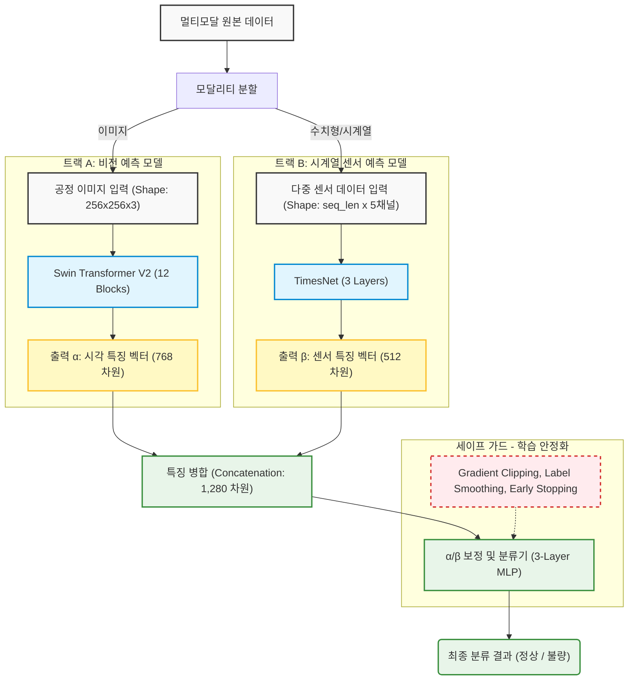

# 멀티모달 분류 모델 아키텍처 (Early Fusion 구조)

본 문서는 `1.classification` 폴더 내에 구현된 `DualEncodingModel`의 데이터 흐름과 구조를 시각화하고 각 구성요소의 입출력을 설명합니다.

## 1. 아키텍처 다이어그램

## 2. 각 모듈별 상세 스펙 (Input / Output 및 Layer 구조)

### 2.1 총 데이터 분할 (Modality Split)
물리적인 시각 정보와 센서 정보를 두 개의 흐름으로 나눕니다.
*   **Input**: 멀티모달 원본 데이터 (이미지 파일, 시계열 csv/npy 데이터 묶음)
*   **Output**: 
    1.  전처리된 이미지 데이터
    2.  스케일링된 5채널 시계열 센서 데이터 (온도, 습도, 진동, 가스, 소음)

---

### 2.2 트랙 A: 비전 예측 모델 (Image Encoder)
이미지 내부의 결함이나 패턴을 인식합니다.
*   **Input**: 256 x 256 사이즈로 리사이즈 및 정규화된 이미지 텐서 `[Batch, 3, 256, 256]`
*   **Model**: Swin Transformer V2 (Tiny)
    *   **Layer 구성**: 총 4개의 Stage로 이루어지며, 내부에 **12개의 Swin Transformer Block**이 `[2, 2, 6, 2]` 구조로 쌓여 있습니다.
*   **Output ($\alpha$)**: 비전 특징이 압축된 768차원의 벡터 `[Batch, 768]`

---

### 2.3 트랙 B: 시계열 센서 예측 모델 (Sensor Encoder)
주기적인 센서 변화와 이상 패턴을 인식합니다.
*   **Input**: 패딩 및 전처리된 시계열 텐서 `[Batch, Sequence_Length, 5]`
*   **Model**: TimesNet (다차원 시계열 분석 모델)
    *   **Layer 구성**: 설정에 따라(`e_layers=3`) **총 3개의 TimesBlock Layer**가 연속적으로 쌓여 특징을 추출합니다.
*   **Output ($\beta$)**: 시계열 특징이 압축된 512차원의 벡터 `[Batch, 512]`

---

### 2.4 세이프 가드 (학습 안정화 기법)
모델이 학습 중 극단적인 값을 뱉거나 과적합되지 않도록 방지하는 소프트웨어적 제어기입니다.
*   **Gradient Clipping**: 그래디언트 폭발을 방지하여 가중치($\alpha, \beta$ 반영 비율)가 과도하게 변경되는 것을 제어 (max_norm=1.0).
*   **Label Smoothing**: 정답을 100% 확신하지 않게 만들어 일반화 성능 개선.
*   **Early Stopping**: 학습 효율 및 과적합 제어 (Patience=10).

---

### 2.5 $\alpha$ / $\beta$ 보정 및 결합 (Fusion & Calibration)
추출된 서로 다른 성질의 특징 벡터의 스케일을 맞추고(보정) 최적의 예측을 위한 가중치를 재할당합니다.
*   **Input**: $\alpha$ (768) + $\beta$ (512) 를 이어붙인 결합 벡터 `[Batch, 1280]`
*   **Model**: 다층 퍼셉트론(MLP) 레이어 
    *   **Layer 구성**: **3층 구조의 선형 레이어 (3-Layer MLP)** 로 구성되어 있습니다. 차원을 점진적으로 축소하며 결합합니다. (1,280 -> 512 -> 128 -> 2 차원)
*   **Output**: 2차원(분류 클래스 수)의 로짓(Logit) `[Batch, 2]`

---

### 2.6 최종 분류 결과 (Output)
*   **Input**: 결합 레이어를 통과한 로짓(Logit)
*   **Output**: 해당 샘플의 정상 / 불량 상태에 대한 최종 예측 클래스 및 확률 값.
